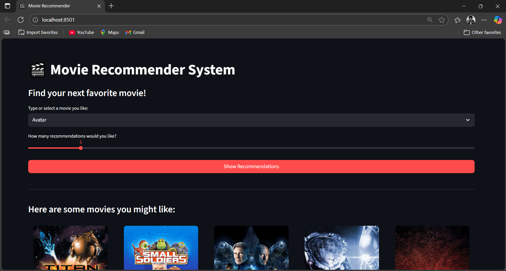
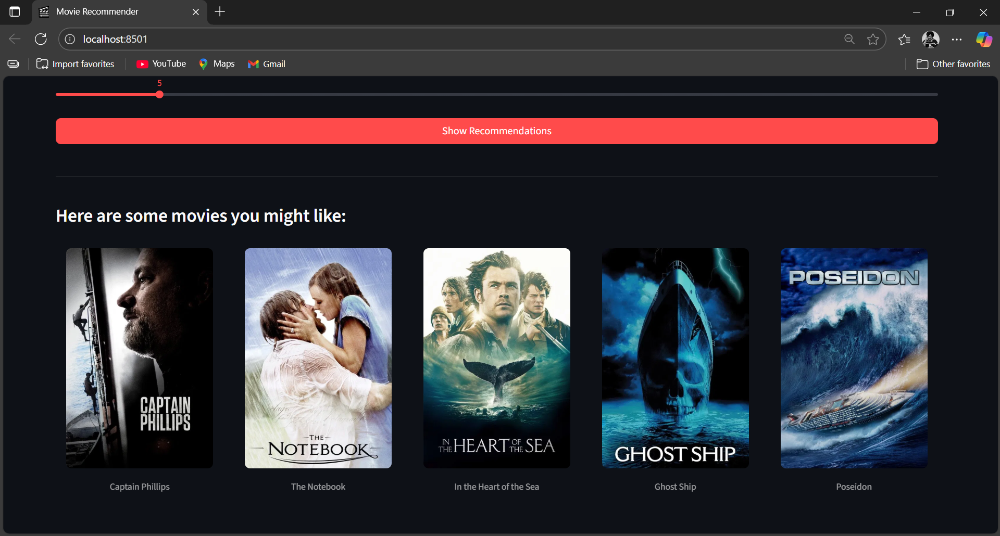

# 🎬 Movie Recommender System  

[](https://www.python.org/)  
[](https://streamlit.io/)  
[](LICENSE)  

A sleek and interactive *Movie Recommender System* built with *Python* and *Streamlit*.  
This app provides *personalized movie recommendations* based on content similarity, with an intuitive interface and visual movie posters

---
## 📸 Screenshots

### Homepage


### Recommendations Example



## ✨ Features  

- 🖥 *User-Friendly Interface* – Clean and interactive web UI with Streamlit.  
- 🎯 *Customizable Recommendations* – Choose how many movies you want (1–20) using a slider.  
- ⚡ *Instant Suggestions* – Select a movie and instantly get similar recommendations.  
- 🧩 *Content-Based Filtering* – Uses overview, genres, keywords, cast & crew for better accuracy.  
- 🎞 *Movie Posters* – Displays official posters for each recommendation.  

---

## 🧠 How It Works  

The recommendation engine uses *content-based filtering*:  

1. *Data Preprocessing* – Uses the TMDB 5000 Movies dataset, merging genres, keywords, overview, cast, and crew into a single *tags* column.  
2. *Text Vectorization* – Converts text into numerical vectors with *CountVectorizer (Bag of Words)*.  
3. *Similarity Calculation* – Computes *cosine similarity* between movies.  
4. *Generate Recommendations* – When a movie is selected, the system finds the top *N similar movies* (N chosen by slider).  

---

## 🚀 Installation & Setup  

### ✅ Prerequisites  
- Python *3.9+*  
- pip package manager  

---

### 1. Clone the Repository  
```bash
git clone https://github.com/your-username/Movie-recommender-system.git
cd movie-recommender-system


---

2. Create & Activate Virtual Environment

On macOS/Linux:

python3 -m venv venv
source venv/bin/activate

On Windows:

python -m venv venv
.\venv\Scripts\activate


---

3. Install Dependencies

pip install -r requirements.txt


---

▶ Usage

Run the Streamlit app:

streamlit run app.py

App will open in browser → http://localhost:8501

Select your favorite movie 🎥

Adjust the slider for number of recommendations 🎚

Enjoy your personalized movie list! 🎉

Made with ❤️ By Shazim Javed
